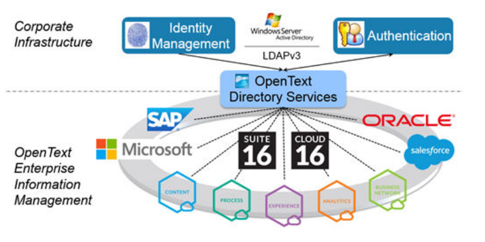
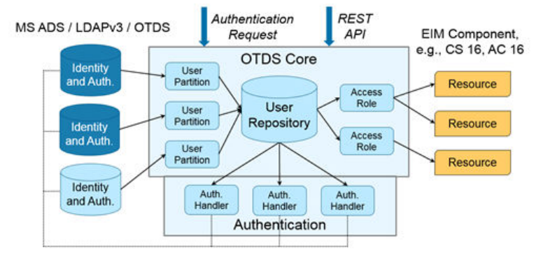
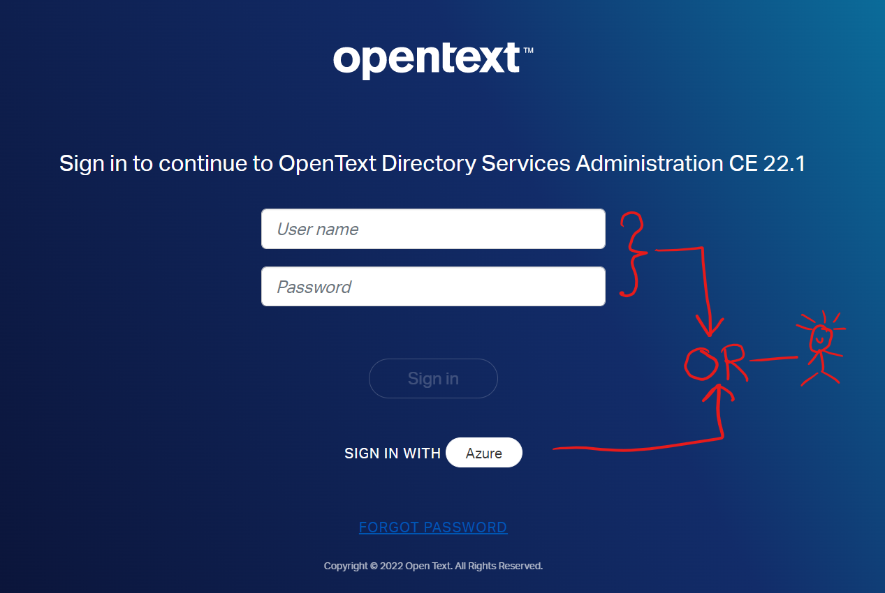
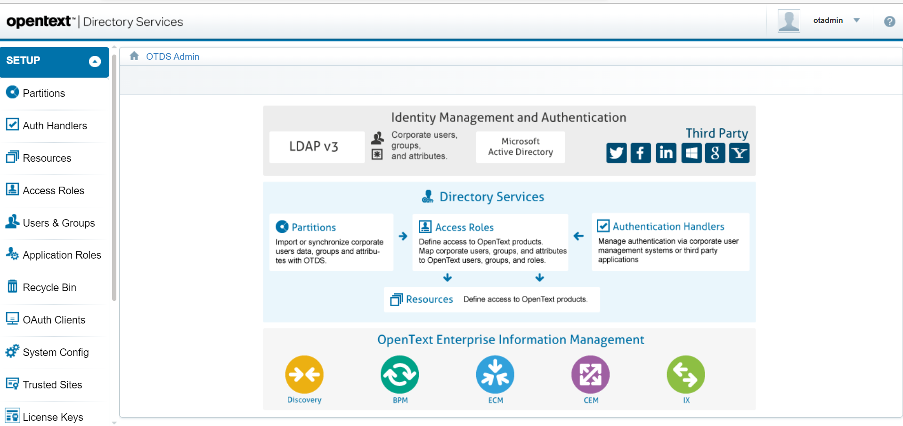

# OpenText™ Directory Services (OTDS)
 
## What is OpenText Directory Services?
If you are familiar with IdaaS (Identity as a Service) concept, and have used OKTA/Auth0/Azure-AD, this is quite similar, but it has some main differences:
  1. This is infrastructure independent. i.e. run in local PC or cloud instances or Kubernetes clusters on any Windows/Unix OS. 
  2. This provides hybrid approach to replicate users from various sources (AD, LDAP, etc.)
  3. It provides great features to Documentum eco-system. E.g., User & Group Consolidation, pluggable push connector to create and maintain users in Documentum.

Directory Services is a repository of user and group identity information and a collection of services to manage this information for OpenText applications. OTDS contains components for identity synchronization and single sign on for all OpenText applications. Directory Services offers synchronization and authentication features that can help your organization save time, and administrative overhead, by enabling you to maintain user information in one directory, for use by multiple OpenText applications. For example, you can base your OpenText Content Server user information on the user information already contained in your Windows domain. If your organization maintains several Enterprise Server systems, they can all use the same central user directory. Directory Services can synchronize with your identity provider to pull user and group information from your identity provider automatically. Directory Services then pushes these users and groups to your OpenText applications automatically and incrementally. This synchronization of user and group data across OpenText applications allows Directory Services to enable single sign on and secure access to all OpenText applications.


## Installation Steps (Manual Docker Build)
Although official guides are there to use Helm Charts on Kubernetes Cluster, but I find it easy to start with basic docker containers. This allow me to understand the basic installation procedure and at the same time using containers to re-provision things fast in case things are not going well.

Here are some instructions that could help you provision OTDS for your POC. In my use case I'm using Postgres as Database, Unix as OS and Tomcat 10 with OpenJDK 11.

  1. Provision Postgres Docker Container and create `otds` database
     I have a local docker network (dctm-dev) that I use to connect whole Documentum stack and its sub components like postgres etc. 
     This allow me to use docker hostname as FQDN.
     
     ```
     docker network create dctm-dev
     docker run --network dctm-dev --name postgres --hostname postgres -e POSTGRES_PASSWORD=password -d -p 5432:5432 postgres:11
     ```
     
     Database script for `otds` database
     
     ```
     CREATE ROLE otds WITH
     LOGIN
     NOCREATEDB
     NOCREATEROLE
     NOINHERIT
     NOREPLICATION
     SUPERUSER
     CONNECTION LIMIT -1
     PASSWORD 'password';
	    
     COMMENT ON ROLE otds IS 'User for OTDS database';

     CREATE DATABASE otds WITH 
     OWNER = otds
     ENCODING = 'UTF8'
     CONNECTION LIMIT = -1;
 
     COMMENT ON DATABASE otds
     IS 'OpenText Directory Services';

     GRANT ALL ON DATABASE otds TO otds;
     ```
      
  2. Provision Tomcat Docker Container
     Create a tomcat 10 docker container with java 11.
     
     ```
     docker run --network dctm-dev -d --name documentum-otds --hostname documentum-otds -p 9001:8080 tomcat:10
     ```
     
  3. Install OTDS
     a. Download Official 'otds-2210-lnx.tar' file from OpenText Download Centre (under 'All Products')
     b. Extract and fix some shell scripts
        I assume that the directory where tar file has been placed is `/media-files/OTDS`
        ```
        tar -xf otds-2210-lnx.tar 
        sed -i 's/bin\/sh/bin\/bash/g' tools/checkJDBCstring.sh
        ```
     c. Create a response file
        This is a silent installer response file which will be used to setup OTDS.
        ```
        cat << EOF > response.properties
        [Setup]
        Id=OTDS
        Version=22.1.0.3968
        Patch=0
        Basedir=/usr/local/tomcat/temp/
        Configfile=/usr/local/tomcat/temp/setup.xml
        Action=Install
        Log=
        Instance=1
        Feature=All

        [Property]
        INST_GROUP=root
        INST_USER=root
        INSTALL_DIR=/usr/local/OTDS
        TOMCAT_DIR=/usr/local/tomcat
        PRIMARY_FQDN=documentum-otds
        ISREPLICA_TOPOLOGY=0
        OTDS_PASS=password
        IMPORT_DATA=0
        ENCRYPTION_KEY=
        MIGRATION_OPENDJ_URL=
        MIGRATION_OPENDJ_PASSWORD=password
        JDBC_CONNECTION_STRING=jdbc:postgresql://postgres:5432/otds
        JDBC_USERNAME=otds
        JDBC_PASSWORD=password
        EOF
        ```
     d. Copy required files for next step
        ```
        docker cp otds-2210-lnx.tar documentum-otds:/usr/local/tomcat/temp/
        docker exec documentum-otds sh -c 'cd /usr/local/tomcat/temp/; tar -xf otds-2210-lnx.tar'
        docker cp tools/checkJDBCstring.sh documentum-otds:/usr/local/tomcat/temp/tools/
        docker cp response.properties documentum-otds:/usr/local/tomcat/temp/
        ```
     e. Install OTDS
        ```
        docker exec documentum-otds sh -c 'cd /usr/local/tomcat/temp/; ./setup -rf response.properties -qi -l otds-installer.log'
        ```
     
  4. Test OTDS Admin Portal
     Connect to OTDS Admin using the url and credentials below:
     
     http://{DOCKER-HOST}:9001/otds-admin
     
     User Name : otadmin@otds.admin
     
     Password : password (Same as OTDS_PASS in response file)
     
     
     
     
     
     
     
  5. Follow the official user guide to setup OTDS for Documentum, xCP SSO. 
     Next version of this page will be published soon to provide some more details.

## Check List
You can use the following checklist to configure a basic installation of Directory Services for demonstration:

1. Install Java.

2. Install Apache Tomcat. Start Tomcat and watch for start-up success in the logs.

3. Create a database for OTDS to use.

4. Install OpenText Directory Services.

5. Sign into your server using the OTDS web client.

6. Optionally, specify the password settings for all users in an OTDS non-synchronized user partition.

7. Optionally, specify the audit reporting settings and notification settings for OTDS.

8. Define a user partition. It can be synchronized or non-synchronized.

9. Configure an access role for your new user partition.
